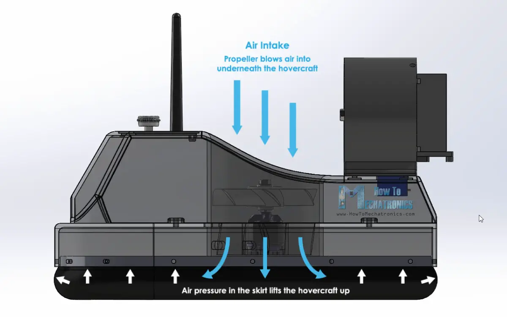
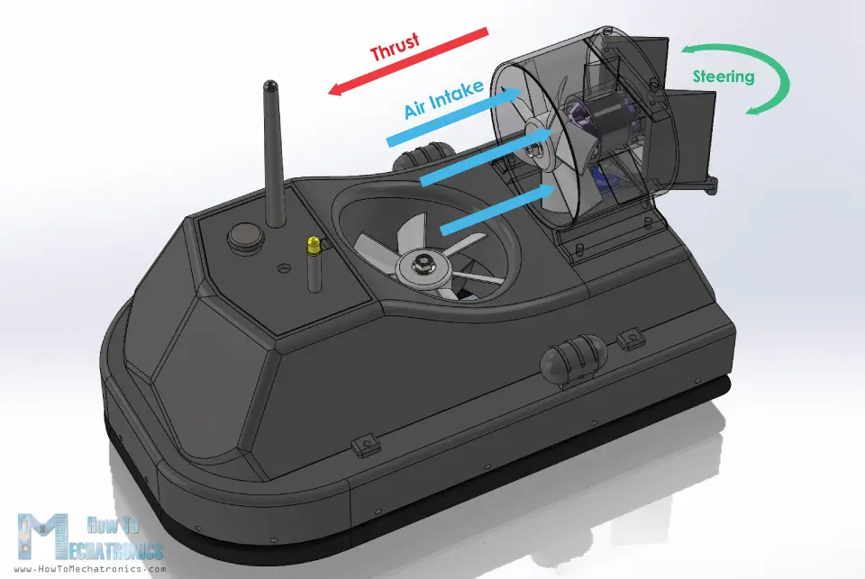
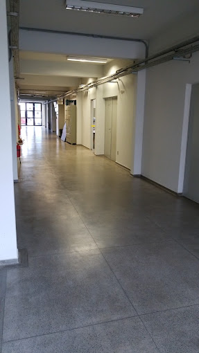

# Hovercraft Autônomo

Projeto de iniciação dos bixos no [Grupo SEMEAR](https://github.com/Grupo-SEMEAR-USP), do Núcleo de Robótica Aérea (NRA).

## Autores 
|  [ Marco Garcia](https://github.com/marcogarcia2) |
| :---: | 

## Proposta
**O projeto consiste na construção de um Hovercraft autônomo, capaz de perceber o mundo e tomar decisões de movimento.**

Um Hovercraft é um veículo projetado para flutuar e se deslocar sobre uma camada de ar comprimido, criada por ventiladores que forçam o ar através de uma almofada de ar sob sua parte inferior. A embarcação flutua sobre a superfície e se desloca com relativa facilidade sobre diferentes tipos de terreno, incluindo água, gelo, pântanos e até mesmo terrenos acidentados. Isso é possível devido à combinação de uma almofada de ar e, geralmente, um motor que o propulsiona para frente.

  
  

<figcaption style="font-size: 12px;">
    Fonte: <a href="https://howtomechatronics.com/projects/diy-arduino-based-rc-hovercraft/" style="text-decoration: underline;">https://howtomechatronics.com/projects/diy-arduino-based-rc-hovercraft/</a>
</figcaption>

## Inspirações
Citar aqui os links das inspirações, HowToMechatronics etc

## O Grupo
Nosso grupo foi subdividido em quatro áreas fundamentais: Mecânica, Eletrônica, Firmware e Software. Cada uma dessas áreas desempenha um papel essencial no funcionamento do nosso robô, contribuindo de maneiras distintas para garantir o sucesso de nosso projeto.

1. **Mecânica:**
Responsável por realizar os cálculos necessários para criar o esqueleto físico do robô, isto é, o design e a construção do casco através do AutoCAD.  

2. **Eletrônica:**
Projetar o diagrama eletrônico, selecionar e montar os circuitos e componentes elétricos do robô, incluindo os cálculos que garantem a alimentação elétrica correta do robô.

3. **Firmware:**
Desenvolver o código que reside diretamente nos componentes eletrônicos, como microcontroladores, e estabelecer a sua comunicação com os outros componentes eletrônicos do robô.  

4. **Software:**
Processar as informações provenientes da câmera e desenvolver algoritmos de tomada de decisão, responsáveis por controlar a movimentação do robô.

## O Desafio
A grande tarefa deste projeto é a de que o robô seja capaz de deslizar por uma superfície com uma velocidade mínima e de forma autônoma, ou seja, sem interferência humana em seu controle. Este trecho será o corredor do CROB (Centro de Robótica da USP), que possui uma superfície consideravelmente lisa para que o hovercraft possa realizar seu percurso.

  

  Corredor do CROB

Foi dada ao nosso grupo a permissão de modificar o ambiente da maneira que quiséssemos, isto é, adicionando objetos que guiariam o robô pelo corredor. 

## O nosso Robô 
Nos inspiramos no personagem "Relâmpago McQueen" do filme "Carros". Em homenagem ao filme, nosso robô foi batizado de Relâmpago Marquinhos.

Inserir imagens do Relâmpago Marquinhos lado a lado com o nosso Marquinhos pronto.

### Mecânica
Detalhes da Mecânica (autor: Soninho)
Fotos do CAD, detalhes de como foi feito e fotos

### Eletrônica
Detalhes da Eletrônica, diagramas, fotos dos componentes (autor: Craque)

### Firmware
Detalhes do Firmware, foto da Rasp, detalhes do PWM (autores: Thiago e Rapunzel)

### Software
ROS, OpenCV, Controle PID, Simulações (autores: Marco e Borba2)

