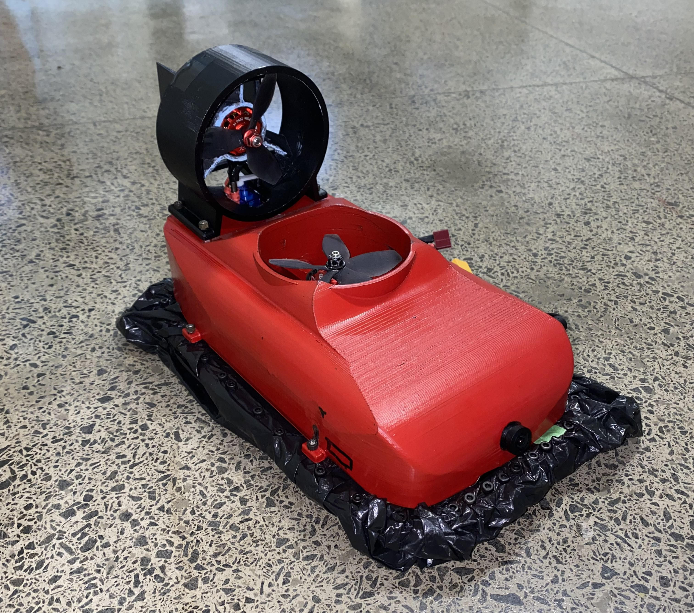
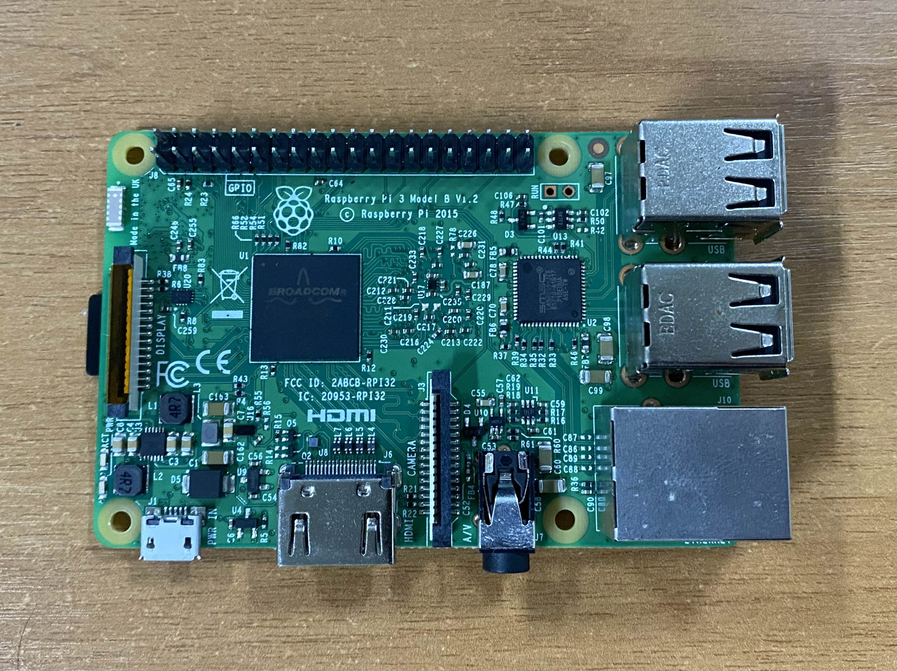
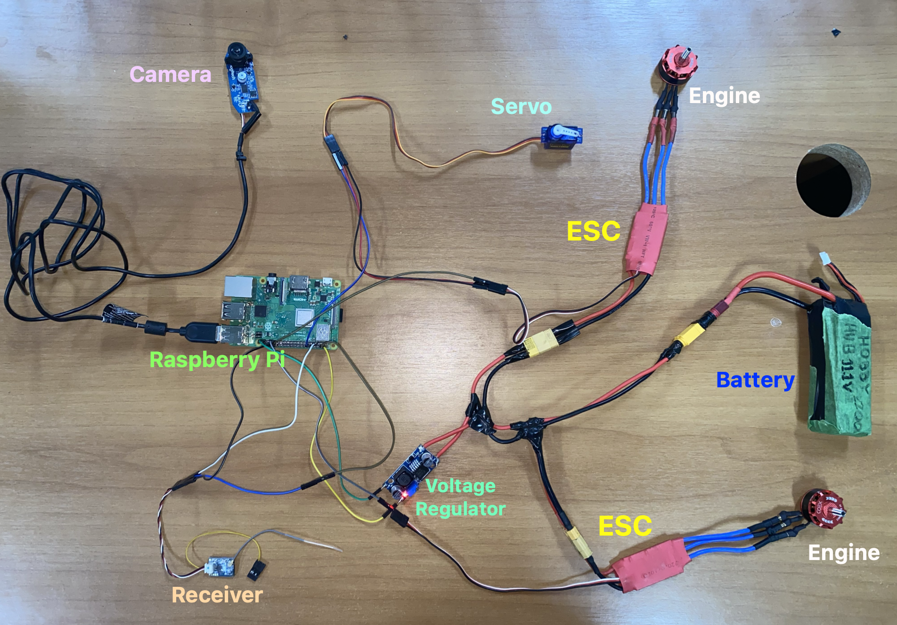
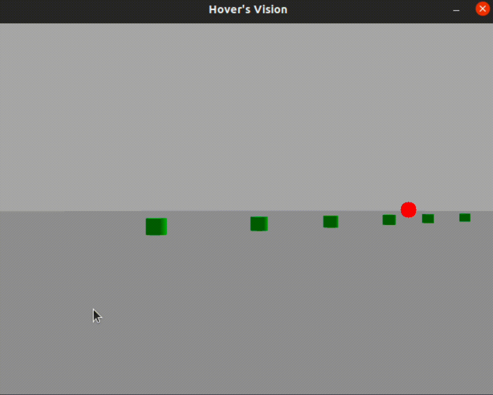

# Autonomous Hovercraft

Freshmen initiation project at [Grupo SEMEAR](https://github.com/Grupo-SEMEAR-USP), of its Aerial Robotics Core (NRA).

## Authors 
|  [ André Villalba](https://github.com/AndreBorba)  |  [ Lucas Barros](https://github.com/LucasBarros93)  |  [ Marco Garcia](https://github.com/marcogarcia2) |
| :---: | :---: | :---: |

| [ Maria Monteiro](https://github.com/MariaClaraMAF) | [ Natália Fernandes](https://github.com/natalia-ssf) | [ Thiago Gonçalves](https://github.com/thiagokg314)  |
| :---: | :---: | :---: |

*Disclaimer: images without a specified source are photos taken by our group.*

## Proposal

**The project consists of constructing an autonomous Hovercraft, capable of perceiving the world and making decisions about its movement.**

A `Hovercraft` is a vehicle designed to float and move on a cushion of compressed air created by fans that force air through a cushion beneath its underside. The craft hovers above the surface and moves with relative ease across various terrains, including water, ice, swamps, and even rough terrain. This is made possible through the combination of an air cushion and usually a forward-propelling engine.

  
  

<figcaption style="font-size: 12px;">
    Source: <a href="https://howtomechatronics.com/projects/diy-arduino-based-rc-hovercraft/" style="text-decoration: underline;">https://howtomechatronics.com/projects/diy-arduino-based-rc-hovercraft/</a>
</figcaption>

## Inspirations
Nossa principal inspiração foi o artigo =="DIY Arduino based RC Hovercraft"==, do site *How to Mechatronics*. A mecânica 

Our main inspiration was 

## The Group
Our group has been subdivided into ==four== fundamental areas: Mechanics, Electronics, Firmware, and Software. Each of these areas plays an essential role in the operation of our robot, contributing in distinct ways to ensure the success of our project.

> 1. **Mechanics**
Responsible for performing the necessary calculations to create the physical skeleton of the robot, which involves the design and construction of the hull using AutoCAD. 

> 2. **Electronics**
Design the electronic diagram, select and assemble the robot's electrical circuits and components, including calculations to ensure the correct electrical supply to the robot.

> 3. **Firmware**
Operate at the heart of the robot, developing the code that communicates the microcontroller with the electronic components of the robot.

> 4. **Software**
Process the information coming from the camera and develop decision-making algorithms responsible for controlling the robot's movement.

## The Challenge
The main task of this project is for the robot to ==glide== across a surface at a minimal speed and ==autonomously==, meaning without human interference in its control. This segment will be the corridor at CROB (USP Robotics Center), which has a fairly smooth surface for the hovercraft to navigate.

  

  CROB corridor

Our group was granted permission to modify the environment as we wished, meaning adding objects that would guide the robot through the corridor.

## The Robot 

We pay tribute to the character "Lightning McQueen" from the movie "Cars," and our robot has been christened as `Marquinhos`.

  

  Lightning McQueen

  

  Marquinhos

All of our robot's code has been developed in `Python`. To command the system and facilitate efficient communication among its various components, we employ `ROS` (Robot Operating System), a widely recognized open-source platform that provides a range of essential tools and libraries for the development of autonomous robotic systems.

The "heart" of our robot is a `Raspberry Pi`, which controls all the electronic components. It has been flashed with a Clover Image, designed specifically to operate on drones and contains all the necessary software for working with Clover and programming autonomous flights. The Clover platform is based on Raspbian OS (Source: https://clover.coex.tech/en/image.html).

  

  Raspberry Pi 3

Below, we will provide more details about each part of Marquinhos.

### Mechanics
| [ Natália Fernandes](https://github.com/natalia-ssf) |
| :---: |

(SONINHO ESCREVA AQUI)
Detalhes da Mecânica
Fotos do CAD, detalhes de como foi feito e fotos

### Electronics
| [ Maria Monteiro](https://github.com/MariaClaraMAF) |
| :---: |

(CRAQUE ESCREVA AQUI)
Especificar TODOS os componentes eletrônicos.
Detalhes da Eletrônica, diagramas, fotos dos componentes

  

  Assembly of the circuit

### Firmware

| [ Lucas Barros](https://github.com/LucasBarros93) |  [ Thiago Gonçalves](https://github.com/thiagokg314) |
| :---: | :---: |

A comunicação entre o software e a eletrônica foi realizada através de alguns nós criados por meio das bibliotecas ROS. (Citar as bibliotecas utilizadas aqui, pigpio, ROS Services, etc). Os pinos da Raspberry Pi 3...

### Software

|  [ André Villalba](https://github.com/AndreBorba)  |  [ Marco Garcia](https://github.com/marcogarcia2) |
| :---: | :---: |

The only sensor on our robot is the ==camera==, so it's crucial that the computer vision code functions extremely well. We used the `OpenCV` library to process the images captured by the camera and generate the control setpoint. Our team decided to set up the CROB corridor in the following way: green cans would be placed on the left side of the corridor, while red cans would be placed on the right side. These cans follow the curve, and the robot's control code operates based on the colors and the proximity of the cans.

Before testing with the actual robot, we conducted simulations in `Gazebo`, a simulation software compatible with ROS. The `PID control` was tuned based on the simulation, and the curve was being executed correctly. 

  
  

However, it's worth noting that the simulation was conducted with a wheeled robot and doesn't reflect a real hovercraft, let alone a real environment with external interferences. Therefore, the PID needs to be tuned with the actual robot.

## Testing the Robot

## Final

Special thanks to:

- Caio Florentin, [Github](https://github.com/caiofln)
- Caio Rovetta, [Github](https://github.com/CaioRovetta15)
- Guilherme Soares, [Github](https://github.com/guisoares9)
- Gustavo Centenaro,
- Felipe Tommaselli, [Github](https://github.com/Felipe-Tommaselli)
- Lucas Kido,
- Marco Tayar, [Github](https://github.com/marcotayar)
- Sophia Benevides, [Github](https://github.com/)
